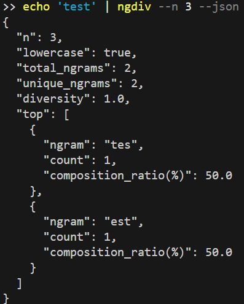

# ngram-diversity
n-gram analysis of text to check its diversity

## setup
```
git clone https://github.com/NexCairn/ngram-diversity.git
cd ngram-diversity
pip install -e .
```

## Usage
### Analyse from text file

```
ngdiv --n 3 --json test.txt
```


### Analyse from stdin
```
echo 'test' | ngdiv --n 3 --json
```


### Output format without Json

Removing `--json` option will output result in raw text.


